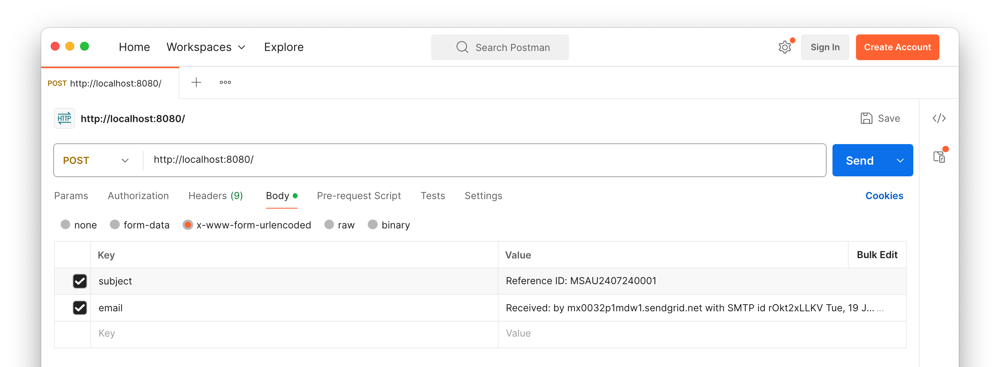

# Example PHP Web App That Interacts With SendGrid's Inbound Parse Webhook


This is a small PHP web-based application that shows how to interact with SendGrid's [Inbound Parse Webhook](https://www.twilio.com/docs/sendgrid/for-developers/parsing-email/setting-up-the-inbound-parse-webhook).
It creates a note on a fictitious user's account with details from an email send in a POST request to the application.

The application supports an upcoming tutorial on [the Twilio blog](https://www.twilio.com/en-us/blog).

## Prerequisites/Requirements

To run the code, you will need the following:

- PHP 8.3 (or above, if later versions are stable) with the following extensions:
  - [ctype](https://www.php.net/manual/en/book.ctype.php)
  - [dom](https://www.php.net/manual/en/book.dom.php)
  - [json](https://www.php.net/manual/en/book.json.php)
  - [libxml](https://www.php.net/manual/en/book.libxml.php)
  - [mailparse](https://www.php.net/manual/en/book.mailparse.php)
  - [mbstring](https://www.php.net/manual/en/book.mbstring.php)
  - [phar](https://www.php.net/manual/en/book.phar.php)
  - [tokenizer](https://www.php.net/manual/en/book.tokenizer.php)
  - [xml](https://www.php.net/manual/en/book.xml.php)
  - [xmlwriter](https://www.php.net/manual/en/book.xmlwriter.php)
- [Composer](https://getcomposer.org) installed globally
- [Docker Desktop](https://www.docker.com/products/docker-desktop/)
- A network testing tool such as [curl](https://curl.se/) or [Postman](https://www.postman.com/)
- [Ngrok](https://ngrok.com/)
- A Twilio account (free or paid) with an active phone number that can send SMS. 
  If you are new to Twilio, [create a free account](https://www.twilio.com/try-twilio).

### How to install the mailparse extension

If the mailparse extension is not provided by your operating system's package manager, then the next best way to install it is with Pecl.
To install it that way, assuming that you have Pecl installed and available in your system path, run the following command

```bash
pecl install --alldeps mailparse
```

After the command completes, check that the extension is installed and enabled by running the following command.

```bash
php -m | grep mailparse
```

If you see `mailparse` printed to the terminal, then it is installed and enabled.

Alternatively, you could use the included Docker Compose configuration.

## How to set up the application

### Set the required environment variables

After cloning the code, copy _.env.example_ as _.env_.
Then, retrieve your Twilio _Account SID_, _Auth Token_, and _phone number_, and set them as the values of `TWILIO_ACCOUNT_SID`, `TWILIO_AUTH_TOKEN`, and `TWILIO_PHONE_NUMBER` respectively.
You can find all three in the **Account Info** panel of [the Twilio Console's dashboard](https://console.twilio.com).
The fourth environment variable will be set shortly.

### Set up the application's database

At the bottom of database/dump.sql, are two `INSERT` commands.
Change the default values of the first one to your name, email address, and your mobile/cell phone number (which must be in [E.164 format](https://www.twilio.com/docs/glossary/what-e164)).

Then, in _email/sendgrid-example.eml_, you'll see the following line.

```eml
From: [[YOUR NAME]] <[[YOUR EMAIL ADDRESS]]>
```

Replace `[[YOUR NAME]]` with your name, and `[[YOUR EMAIL ADDRESS]]` with your email address. 

# How to use the application

### Start the application

To run the project, you can either use Composer or the included Docker Compose configuration.

```bash
# Start the project with Composer
composer serve

# Start the project with Docker Compose
docker compose up -d
```

### Expose the application to the public internet 

Start ngrok, to expose the application to the public internet on port 8080, by running the following command.

```bash
ngrok http 8080
```

This will print output to the terminal similar to the following:

```bash
ngrok                                                                                                  (Ctrl+C to quit)
                                                                                                                       
Found a bug? Let us know: https://github.com/ngrok/ngrok                                                               
                                                                                                                       
Session Status                online                                                                                   
Account                       Awesome User (Plan: Free)                                                               
Update                        update available (version 3.13.0, Ctrl-U to update)                                      
Version                       3.10.0                                                                                   
Region                        Australia (au)                                                                           
Web Interface                 http://127.0.0.1:4040                                                                    
Forwarding                    https://cca2-1-146-99-255.ngrok-free.app -> http://localhost:8080
```

Copy the **Forwarding URL** and set it in _.env_ as the value for `APP_BASE_URL`.

## How to use the application

Once up and running, use a network testing tool such as curl or Postman to make a POST request to the default route, providing two POST parameters: 

- **subject:** This is the email's subject.  
  It must match one of the following two, case-insensitive, formats: `Reference ID: <<REF_ID>>` or `Ref ID: <<REF_ID>>`. 
  `REF_ID` is a 14 character string, which can contain lower and uppercase letters from A to Z (inclusive) and any digit between 0 and 9 (inclusive).
- **email:** This is the plain text version of an email (or a .eml file). You can find a sample one in the _email_ directory named _sendgrid-example.eml_.

Here is an example of making a request with curl:

```bash
curl \
  --form "subject=Reference ID: MSAU2407240001" \
  --form "email=@email/sendgrid-example.eml" \
  <<NGROK FORWARDING URL>>
```

Alternatively, you could use Postman, if you prefer a GUI.



Set the request type to `POST` and the Ngrok Forwarding URL as the URL.
Then, under **Body**, set the request type to `x-www-form-urlencoded`.
Add two keys:

- `subject`: Set this to `Reference ID: MSAU2407240001`
- `email`: Set this to the contents of _email/sendgrid-example.eml_

Then, make the request by pressing **Send**.

If the request is successful, you'll see `{"status":"success","data":{"reference id":"MSAU2407240001"}}` printed as the response body, and you'll receive an SMS.